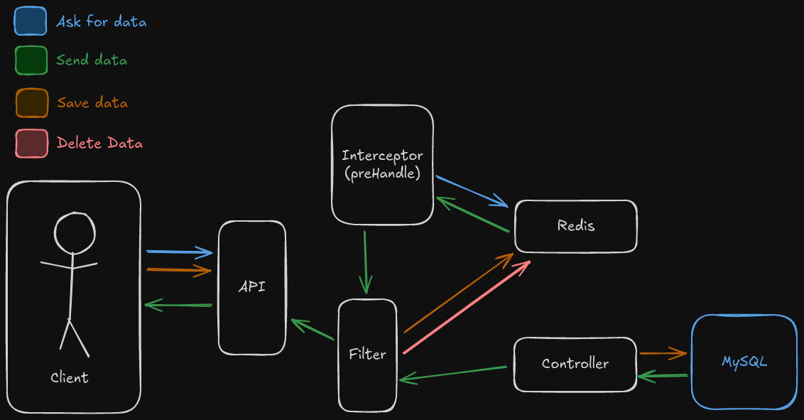

# Api-Redis

&nbsp;

&nbsp;

## _About_

This is a small project made to practice using Redis to optimize HTTP GET method queries without consuming the database (MySQL).




## _How Install_

Java -> **17**

Maven -> **3.9.8**

Docker -> >= **27.3.1**

In the root of project use:

```
docker compose up -d
```
wait to install all images and containers, then execute:
```
mvn clean package
```
after all you navigate to `./target` and execute:
```
java -jar api-0.0.1-SNAPSHOT.jar
```

Now the API is running, you can access by:

_DB connection_:
127.0.0.1:3308

_Redis connection_:
127.0.0.1:6379

_API host and port_:
127.0.0.1:8079


## _How use_

In this repo we are using only two endpoints: 

**[GET]** `api/clients`:
Get all clients in cache or database.

**[POST]** `api/clients`:
Save an client and clear redis cache.
Request body example:
```
{
  "name": "Test 1",
  "age": 20
}
```

## _Contributing_

This project is a personal project, so PR's won't be merged!

## _License_
[See LICENSE](./LICENSE)
